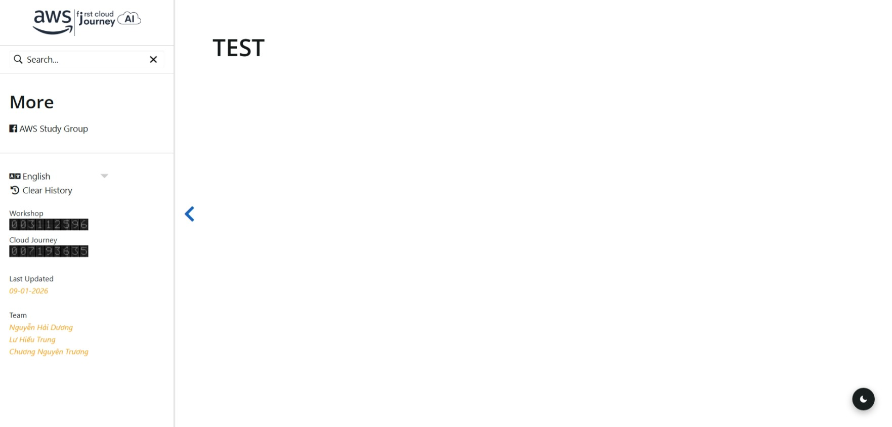

# FCJ Hugo Theme

[](https://gohugo.io) 

<div style="display:flex; gap:10px;">
  
  
</div>

## Installation

Navigate to your hugo project root and run:

```
git submodule add https://github.com/Heahaidu/fcj-hugo-theme themes/fcj-theme
```

Set the theme in your Hugo configuration file `hugo.toml`:

```
theme = "fcj-theme"
```

Then run the development server:

```
hugo server --theme fcj-theme
```
